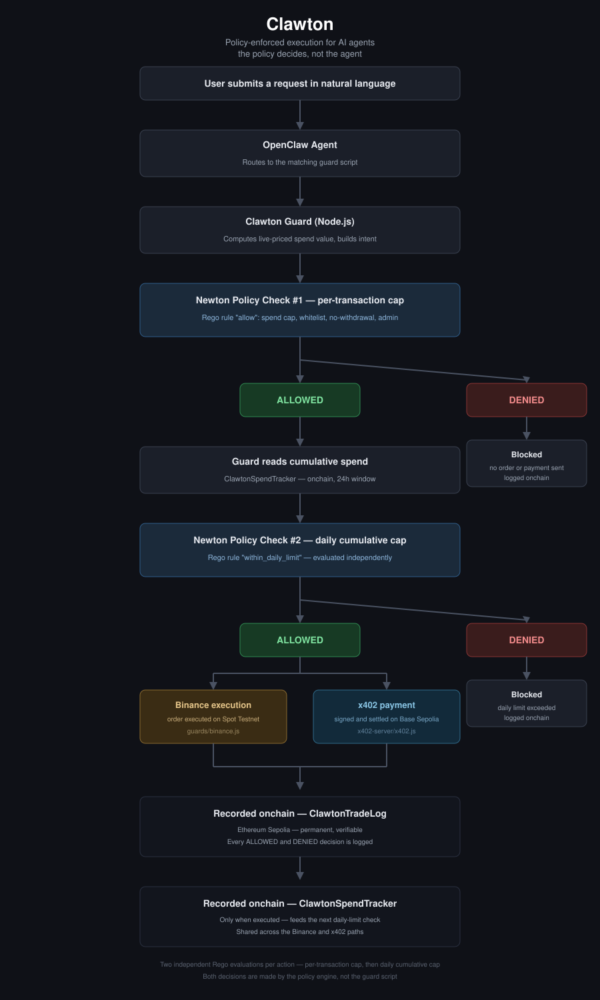

# Clawton

**A policy enforcement layer between an AI agent and real-money execution — trades and payments alike — enforced onchain.**

## Summary

Clawton sits between an AI agent (OpenClaw) and the systems it can spend money through. Every action the agent proposes — a trade on Binance, or a payment for an API resource via the x402 protocol — is evaluated against an onchain policy before it is allowed to execute. Both the approval and the denial of every action are permanently recorded onchain, so the system's behavior is independently verifiable rather than something the agent merely reports.

The project is built on Newton Protocol for policy evaluation and attestation, deployed on Ethereum Sepolia. Two execution paths are currently supported: trade execution on Binance Spot Testnet, and resource payments over the x402 protocol on Base Sepolia.

## The problem

Connecting an AI agent to a trading account or a payment-enabled wallet gives that agent real execution power. A reasoning error, a bad prompt, a prompt-injection attempt, or a plain bug can turn into financial loss with nothing standing between the agent's decision and the money moving. This risk isn't limited to exchanges — the same exposure applies to autonomous agents paying for resources over emerging protocols like x402, where recent academic research has documented overpayment and injection-driven fraudulent-payment attack patterns as open problems, explicitly calling for pre-execution controls as the architecturally sound response. Clawton implements exactly that, on both fronts.

## Design principle

**The policy decides, not the agent.** Whether the agent is proposing a Binance trade or an x402 payment, the request goes through the same independent guard process, evaluated against a policy deployed onchain and immutable at runtime. If the check fails, nothing is executed — no exchange order, no payment signature — no matter what the agent says or how it explains the result. Every check, on either path, is logged both locally and onchain.

## Architecture

This diagram shows the core per-transaction flow. As of the latest update, every allowed action also passes a second, independent daily cumulative-spend check before executing — see "Architecture deep-dive" below for the full two-check flow.

## Deployed contracts (Ethereum Sepolia)

| Contract | Address | Etherscan |
|---|---|---|
| Policy Data | `0x5FC74321B2391e1f1a1aAbc7AD5F399b307bb1d7` | [View](https://sepolia.etherscan.io/address/0x5FC74321B2391e1f1a1aAbc7AD5F399b307bb1d7) |
| Policy | `0x34F575090849668656833Df7414F34b66b91FD24` | [View](https://sepolia.etherscan.io/address/0x34F575090849668656833Df7414F34b66b91FD24) |
| NewtonPolicyWallet | `0xF8593292b751c9874D9B6fa180CD452efFa09e4D` | [View](https://sepolia.etherscan.io/address/0xF8593292b751c9874D9B6fa180CD452efFa09e4D) |
| ClawtonTradeLog (verified) | `0x86b8ED1803c99768D67a81ed1d1a1F9f8f517269` | [View](https://sepolia.etherscan.io/address/0x86b8ED1803c99768D67a81ed1d1a1F9f8f517269) |
| ClawtonSpendTracker | `0x1760001880C71a357eC1Cf0D8C81aD8b30424f42` | [View](https://sepolia.etherscan.io/address/0x1760001880C71a357eC1Cf0D8C81aD8b30424f42) |

Example onchain decisions, permanently recorded:
- [ALLOWED Binance trade](https://sepolia.etherscan.io/tx/0x3ad2c92b546e1fed21c34c42c5b4b280bcb08d46f2fe5a14c242fe28c113bdcd#eventlog) — within the spend cap, executed and logged.
- [DENIED Binance trade](https://sepolia.etherscan.io/tx/0xf17fa9138f24ce214df2f84f63e9d62ef7381060620c6379c64eb1a3ef344a1b#eventlog) — over the spend cap, blocked and logged.
- [ALLOWED x402 payment](https://sepolia.etherscan.io/tx/0x2ae1236bcf57c9bc634c3615a06d8dadc08577bab2206e21df7c42f62824186f#eventlog) — a $0.01 USDC payment on Base Sepolia, settled and logged.
- [DENIED x402 payment](https://sepolia.etherscan.io/tx/0x2b3668e8811fca69dfc1ee513cc4f0d8bafc0dd2b0f308fd06e4d99bb283516a#eventlog) — a $50 payment request exceeding the policy limit, blocked before it was signed.

## Repository layout

| Path | Contents |
|---|---|
| `guards/binance.js` | Guard for the Binance execution path |
| `x402-server/` | x402 resource server, client, and guard |
| `policy/` | Rego policy, WASM oracle, and simulation tooling |
| `contracts/` | NewtonPolicyWallet, ClawtonTradeLog, and ClawtonSpendTracker smart contracts (Foundry project) |

## Components

| Component | Description |
|---|---|
| Rego policy | The policy logic: per-transaction spend cap, daily cumulative cap, recipient/token whitelist, withdrawal block, admin override |
| Policy Data contract | Onchain WASM data provider backing the policy evaluation |
| Policy contract | The deployed Rego policy logic itself |
| NewtonPolicyWallet | Smart wallet contract; binds task manager, policy, and owner atomically at deployment, in a single transaction |
| ClawtonTradeLog | Onchain event log recording every ALLOWED and DENIED decision — for both trades and payments — with its parameters and timestamp |
| ClawtonSpendTracker | Onchain contract recording every executed action's value with a timestamp, exposing a rolling cumulative total used for the daily spend-cap check |
| Clawton Guard (Binance) | Node.js bridge: computes the live ETH-equivalent value of a proposed trade, evaluates it against the deployed policy (per-transaction, then daily cumulative), executes on Binance only if both pass, and writes the outcome onchain either way |
| Clawton Guard (x402) | Node.js bridge: probes an x402-protected resource, computes the live ETH-equivalent value of the requested payment, evaluates it against the same two-stage policy check, and signs the payment only if both pass |
| Agent skill definitions | Instruct the OpenClaw agent to route every trade or payment request through the appropriate guard rather than acting directly, and to report only what the guard's output actually says |

## Policy rules (current)

1. **Per-transaction spend cap** — no single trade or payment may exceed a configured maximum value, computed from a live price feed at evaluation time.
2. **Daily cumulative spend cap** — the running total of all executed actions within a rolling 24-hour window, plus the proposed action, may not exceed a separate configured daily maximum. Shared across both execution paths. See "Architecture deep-dive" below.
3. **Whitelist** — only pre-approved trading pairs (Binance) or recipients (x402) are permitted.
4. **No withdrawals** — any withdrawal-type action is unconditionally denied.
5. **Admin override** — a designated address can bypass the checks above for manual intervention.

The policy is evaluated as fail-closed: any undefined or unrecognized condition results in denial, not approval.

## Onchain verifiability

Every decision — trade or payment, approved or denied — is written to a dedicated event log contract on Sepolia. Anyone can inspect the chain directly and see the verdict, the action type, the amount, and the context that produced that verdict, with an immutable timestamp. This is separate from the action itself, which settles where it belongs (the exchange's order book, or Base Sepolia for x402 payments) — it is an onchain attestation that the check happened and what it concluded.

## Security analysis

The three original contracts (`ClawtonSpendTracker`, `ClawtonTradeLog`, `NewtonPolicyWallet`) were run through three independent static/symbolic analysis tools, each with a different detection methodology:

| Tool | Method | Result |
|---|---|---|
| Slither | Static analysis, 101 detectors | Clean; two gas-efficiency suggestions applied (`immutable` owner fields, zero-address check) |
| Aderyn | Static analysis, 63 detectors | One real finding (below); several findings determined to be false positives after direct code review |
| Mythril | Symbolic execution | No new findings beyond the already-documented `block.timestamp` usage in the daily-window calculation |

**Real finding, fixed and test-proven.** Aderyn flagged `NewtonPolicyWallet.initialize()` as an unprotected initializer — callable by anyone, any number of times, which could let an attacker overwrite the policy client owner after deployment. This was a genuine gap. The fix adds a one-time guard (`_initialized` flag, `AlreadyInitialized` error) directly in the wallet contract. Rather than relying on the static analyzer's re-scan alone, a Foundry test (`contracts/test/NewtonPolicyWalletInit.t.sol`) exercises the actual reinitialization attempt end-to-end and asserts it reverts — this test passes. Note that Aderyn's own re-scan still flags the same line after the fix; its detector pattern appears to look specifically for OpenZeppelin's `Initializable`/`initializer` modifier convention rather than recognizing custom guards, which is why the Foundry test — not another tool re-run — is the actual evidence the fix works.

**Findings reviewed and determined not applicable**, each confirmed by reading the relevant code rather than assumed:
- A "missing `msg.sender` check" flag on the execution function is already covered by the underlying Newton attestation logic, which independently requires `intent.from == msg.sender` before any attestation is considered valid.
- A "mark `public` as `external`" suggestion on an overridden `supportsInterface` function is not applicable, since the parent contract's function is `public` and is called via `super`, which requires matching visibility.
- An "unused custom error" flag was checked directly against the source and is in fact used in a `require(condition, CustomError())` call — the detector's pattern-matching appears not to recognize this newer Solidity error syntax as usage.

## Tech stack

- **Newton Protocol** — Rego-based policy evaluation and WASM data providers, deployed as onchain contracts
- **Foundry** — smart contract development and deployment
- **OpenClaw** — the agent runtime; model-agnostic, currently running an NVIDIA-hosted agentic model
- **Binance Spot Testnet / binance-cli** — trade execution, and the live price source used for spend-cap calculations
- **x402 / Base Sepolia** — resource payment execution
- **Node.js** — the guard processes tying policy evaluation, execution, and onchain logging together

## What's been verified end-to-end

- A Binance trade within policy limits: value computed from a live price feed, evaluated, approved, executed, filled, and logged onchain.
- A Binance trade far outside policy limits: evaluated, denied, never reached the exchange, and the denial itself logged onchain.
- An x402 payment within policy limits: value computed from a live price feed, evaluated, approved, settled on Base Sepolia, resource data returned, and logged onchain.
- An x402 payment far outside policy limits ($50 against a $0.01 baseline): evaluated, denied, payment never signed, and the denial logged onchain.
- The daily cumulative spend cap, enforced independently of the per-transaction cap: repeated small trades on the Binance path pushed the rolling total toward the daily maximum, and a subsequent trade was correctly denied by the policy once the projected total would have exceeded it.
- Cross-path enforcement of the daily cap: cumulative spend accrued from x402 payments alone was sufficient to cause a subsequent, unrelated Binance trade to be denied — confirming the daily limit is tracked against a single shared onchain source, not per execution path.
- The agent, prompted in plain language across both action types, correctly reports the guard's actual output rather than an invented explanation.
- `NewtonPolicyWallet`'s reinitialization guard: a Foundry test confirms a second call to `initialize()` reverts.

## Architecture deep-dive: the daily spend limit

**Goal.** Prevent "salami slicing" — many small actions, each individually within the per-transaction cap, that together exceed a reasonable daily exposure. The original design goal was for the Rego policy itself to read a live cumulative-spend total directly from an onchain contract via the WASM oracle, keeping the "policy decides" principle fully intact even for this aggregate check.

**Constraint (discovered through direct testing, not assumed).** Newton's local policy-simulation tooling (`newton-cli policy simulate`), which this project's guards depend on for every real-time decision, does not support live network calls from within the Rego/WASM oracle layer. This was confirmed through a systematic isolation process:
1. A minimal oracle calling the WASM runtime's `httpFetch` with no arguments — failed with an unrecoverable WASM trap.
2. The same failure with a full `eth_call` payload — identical trap.
3. A custom intent field (`cumulative_spend_wei`) added outside the standard intent schema — silently dropped during intent parsing, confirmed by comparing against a known-working field (`input.value`) in an otherwise identical test.
4. `decoded_function_arguments`, a field defined in Newton's own official intent schema — also silently dropped locally.

This mirrors an already-documented limitation in this project (`input.function.name` and `input.chain_id` behaving unreliably in local simulation), extended here to network calls and non-core intent fields.

**Decision.** Given the oracle-side approach is not viable with current tooling, the daily limit check uses a hybrid design:
- The guard (`guards/binance.js` / `x402-server/x402.js`) reads the current cumulative spend directly from `ClawtonSpendTracker` via `cast call` — a plain onchain read, unrelated to the broken oracle path above.
- The guard computes `projected total = cumulative spend + this transaction's value` and submits it through `input.value` — the only intent field proven to reliably reach Rego evaluation in local simulation.
- **The guard makes no allow/deny decision.** The actual pass/fail judgment is made exclusively by a dedicated Rego rule (`within_daily_limit`), evaluated independently from the per-transaction spend-cap check, against the same `data.params.max_daily_wei` threshold used across both execution paths.
- This keeps the core principle — the policy decides, not the agent — intact for the decision itself, while working within a confirmed real constraint of the local tooling. The guard's role is limited to arithmetic and data retrieval, both independently verifiable against `ClawtonSpendTracker`'s onchain records.

**Verification.** See "What's been verified end-to-end" above for the specific test results: independent denial of an over-limit transaction on the Binance path, and confirmed cross-path enforcement where x402 spend alone triggered a Binance denial.

## Known limitations (honest, current state)

- **Not professionally audited.** This is an active MVP. Three independent automated analysis tools (Slither, Aderyn, Mythril) have been run against the contracts — see "Security analysis" above — but this is not a substitute for a professional manual security review, and the project should not be used with real funds in its current form.
- **Daily limit check is hybrid, not purely oracle-driven.** As detailed in "Architecture deep-dive" above, the cumulative total is computed by the guard (a plain onchain read plus arithmetic) and submitted to the policy for the actual allow/deny decision, rather than the Rego oracle reading the total independently. This is a direct consequence of a confirmed tooling limitation, not a design preference — see the deep-dive section for the full reasoning and the tests that established it.
- **Testnet-only, two chains.** Ethereum Sepolia (policy) and Base Sepolia (x402 settlement) plus Binance Spot Testnet. No mainnet deployment has been attempted or is currently planned without a security review first.
- **Local simulation caveat.** The local policy-simulation tooling used during development has known limitations in how it parses certain intent fields and in its lack of live network support from within the WASM oracle, worked around in local testing via a separate simulation-only policy file and the hybrid daily-limit design above, without weakening the actual per-transaction onchain policy logic. This is documented for transparency rather than hidden.
- **Single-owner model.** The current deployment is self-custodial and self-administered by design — the deployer's wallet is both the policy admin and the executor across both paths. A multi-tenant version, where each user deploys their own isolated wallet and policy with no platform-level override, is the natural next step and is not yet built.
- **Agent reliability requires active verification.** During development, the agent was observed fabricating a plausible-sounding but incorrect dollar-value calculation, and separately inventing a nonexistent command name, both while sounding fully confident. Both were caught by cross-checking the agent's claims against the guard's actual local log file — which is why that log, not the agent's narration, is treated as the system's source of truth throughout this project.

## Getting started (local setup)

This project is not a hosted service — you run your own instance with your own wallet as the policy admin.

### Prerequisites
- Rust/Cargo, Node.js 20+, Foundry, `newtup` (Newton CLI installer)
- A dedicated development wallet (never reuse a wallet holding real funds)
- Sepolia ETH (Ethereum) and Base Sepolia ETH + USDC, both from free faucets
- A Binance Testnet API key (for the Binance execution path)

### Setup steps
1. Clone the repo and copy `contracts/.env.example` to `contracts/.env`, and `policy/.env.policy.example` to `policy/.env.policy`, filling in your own wallet key and RPC URLs.
2. Install Foundry dependencies: `cd contracts && forge install`
3. Install Node dependencies: `cd x402-server && npm install`
4. Deploy your own policy, wallet, and spend-tracker contracts by following the deployment commands in `newton-policy-guide.md` — this project intentionally does not include a shared, pre-deployed instance for other users to call into.
5. Run `node guards/binance.js '{"symbol":"BTCUSDT","side":"BUY","quantity":"0.001"}'` to test the Binance path, or start `x402-server/server.js` and run `node x402-server/x402.js <resource-url>` to test the x402 path.

Every deployed contract address in this README belongs to the original developer's own instance, shown as a live, verifiable example — not a shared endpoint.

## Status

Functional MVP covering two independent execution paths (Binance trades, x402 payments), both enforced by the same onchain policy with live-priced per-transaction and daily cumulative spend-cap checks, and both fully logged onchain. Actively developed by an independent developer.

## License

MIT
